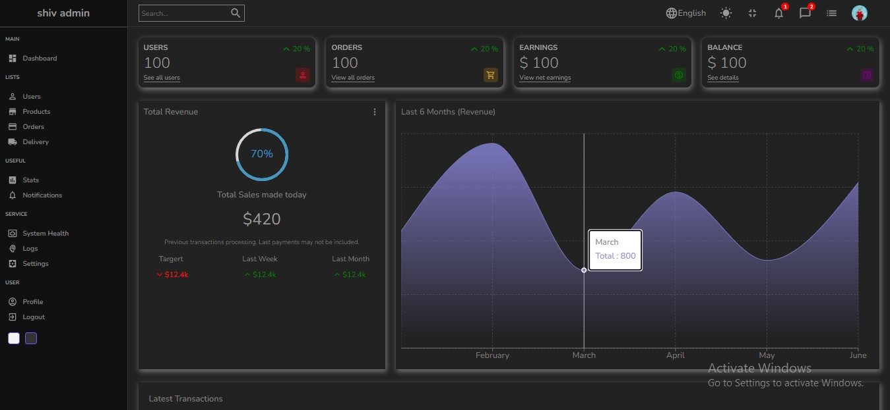

# React.js Simple Dashboard

This is a dashboard built using React.js, and Material UI. It provides a user-friendly interface for data visualization and management. The charts have been developed using recharts.

You can have a look at the demo of this website at: https://youtu.be/bwozf068Yk4

This website was developed refering to the tutorial: https://www.youtube.com/watch?v=yKV1IGahXqA

## Technologies Used
- [React.js](https://reactjs.org/): A JavaScript library for building user interfaces.
- [Material UI](https://mui.com/): A popular UI component library that follows Material Design guidelines.

## Installation
To install and run this dashboard locally, follow these steps:
1. Clone the repository:
    ### `git clone https://github.com/shivaramr/lama-dashboard.git`
2. Navigate to the project directory:
    ### `cd dashboard-project`
3. Install the dependencies:
   ### `npm install`
4. Start the development server:
   ### `npm start`
## Usage
To use the dashboard, follow these steps:
1. Open a web browser and navigate to 'http://localhost:3000'
2. Login using the credentials
3. Explore the various charts, tables, and features available in the dashboard.
